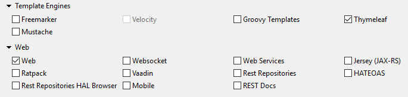

Spring deploy tutorial
===================

####  1 Create Spring Boot Web App

Open Spring Tool Suite, on main menu, choose File->New->Spring Starter Project, add project info, then press Next for needed dependencies:
For Template Engines, choose Thymeleaf
For Web MVC, choose Web->Web



####  2 Open pom.xml file to check dependencies:

```
<dependency>
	<groupId>org.springframework.boot</groupId>
	<artifactId>spring-boot-starter-thymeleaf</artifactId>
</dependency>
<dependency>
	<groupId>org.springframework.boot</groupId>
	<artifactId>spring-boot-starter-web</artifactId>
</dependency>
```

####  3 Create a simple controller WebController

```
package com.javasampleapproach.wardeployment.controller;
 
import org.springframework.stereotype.Controller;
import org.springframework.web.bind.annotation.RequestMapping;
 
@Controller
public class WebController {
	@RequestMapping(value={"/"})
    public String home(){
        return "home";
    }
}
```

Create a simple view page: ``` home.html ```

```
<!DOCTYPE html>
<html xmlns:th="http://www.thymeleaf.org">
 <head>
 <title>SpringBoot Web App deploys on Tomcat</title>
 </head>
 <body>
     <h1 style="color: green">Hello! SpringBoot Web App deploys on Tomcat!</h1>
 </body>
</html>
```

####  4 Extends SpringBootServletInitializer

###### In main class, extends ```SpringBootServletInitializer``` subclass and override configure method. Details:

```
@SpringBootApplication
public class MyApplication extends SpringBootServletInitializer {
	
	@Override
    protected SpringApplicationBuilder configure(SpringApplicationBuilder application) {
        return application.sources(MyApplication.class);
    }
 
	public static void main(String[] args) {
		SpringApplication.run(MyApplication.class, args);
	}
}
```

#### 5 Update build configuration on pom.xml

```
...
<packaging>war</packaging><!-- tomcat website packaging -->
...
```

####  6 For finish deploy War file on Tomcat

Build the project: maven clean install. Then go to target folder, we have a war file: website.war.

Copy website.war to apache-tomcat-x.x.x.x\webapps folder.

Go to apache-tomcat-x.x.x.x\bin, then start:

Window : ```startup.bat```
linux : ```startup.sh```

#### Success
go to ```http://127.0.0.1:8080/website```

Author Jguyet

